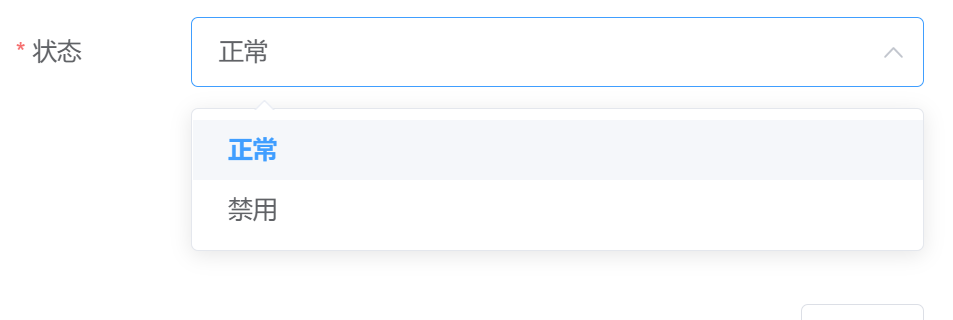

# DictMapper


[](https://app.codacy.com/gh/power4j/DictMapper?utm_source=github.com&utm_medium=referral&utm_content=power4j/DictMapper&utm_campaign=Badge_Grade)
[](https://sonarcloud.io/dashboard?id=power4j_DictMapper)

这是一个从个人项目中剥离出来的小组件，用于前后端统一维护数据字典。在我的项目里面，它叫`常量字典`。

## 使用场景

被注解的枚举类
```java
@MapDict(code = "status_flags", name = "状态")
public enum StatusEnum {
  @Label("正常")
  @Styled("success")
  NORMAL("0"),

  @Label("禁用")
  @Styled("danger")
  DISABLED("1");

  @DictValue
  private final String value;

  StatusEnum(String value) {
    this.value = value;
  }
}
```
访问`/immutable-dictionaries/code/{dictCode}`
```shell
curl  -H "Accept: application/json"  "http://127.0.0.1:18081/immutable-dictionaries/code/status_flags"
```

响应为
```json
{
  "code": 0,
  "msg": null,
  "data": [
    {
      "value": "0",
      "label": "正常",
      "remarks": "",
      "style": "success",
      "order": 0,
      "extra": {}
    },
    {
      "value": "1",
      "label": "禁用",
      "remarks": "",
      "style": "danger",
      "order": 0,
      "extra": {}
    }
  ]
}
```

数据字段的用途：
- `value` 字典项的值，一般会入库保存
- `label` 展示给用户看的
- `remarks` 备注，一般不怎么用
- `style` UI渲染，主要是给前端用的，需要跟前端勾对一下怎么用
- `extra` 如果上面的不够用，想给前端返回的内容中夹带一点私货，就放这里。

向前端输出的内容可以自定义，请注意一下`DictConverter`,`DictItemConverter`,`RestResponseProcessor`这几个接口。或者让前端同事适配一下。

> 详情见演示工程，以及单元测试 
> - [TestEnums](dict-mapper-spring-boot-starter/src/test/java/com/power4j/kit/common/data/dict/support/TestEnums.java)
> - [ItemResolverHelperTest](dict-mapper-spring-boot-starter/src/test/java/com/power4j/kit/common/data/dict/support/ItemResolverHelperTest.java)
> - [DefaultDictResolverTest](dict-mapper-spring-boot-starter/src/test/java/com/power4j/kit/common/data/dict/support/DefaultDictResolverTest.java)

## 前端集成
前端项目中,用得比较多的地方就是下拉框组件,借助后端暴露的接口,就不需要前端维护下拉框的选项了。

比如我的个人项目中使用了[d2-crud-plus](http://d2-crud-plus.docmirror.cn/d2-crud-plus/guide/dict.html#%E5%AD%97%E5%85%B8%E9%85%8D%E7%BD%AE%E5%A4%8D%E5%88%B6) ,那么只需要几行配置代码

```javascript
dict: {
  url: 'status_flags',
  getData: (url, dict) => {
    return dictApi.getItemList('status_flags').then(ret => { return ret.data })
  }
}
```

效果


## 使用说明

在项目中添加依赖
```xml
<dependency>
  <groupId>com.power4j.kit</groupId>
  <artifactId>dict-mapper-spring-boot-starter</artifactId>
</dependency>
```

简单配置一下
```yaml
dict-mapper:
  # 如果需要扫描 @SpringBootApplication 范围外的包，就需要在这里设置
  scan-packages: com.power4j
  # 启用内建的API接口
  enable-endpoint: true
  # 字典接口URL
  endpoint-base-url: /sys/immutable-dictionaries
```


在你的枚举类上，加`MapDict`,`DictValue` 注解。 然后把项目跑起来,访问`/sys/immutable-dictionaries`测试效果。


默认有两个接口可用
- `/sys/immutable-dictionaries/page?current=1&limit=10` 分页查询,一般可能用不上
- `/sys/immutable-dictionaries/code/{code}` 获取某个字典的子项

## Special Thanks

- [JetBrains Developer Toolbox](https://www.jetbrains.com/?from=sequence)


 ## 联系方式


